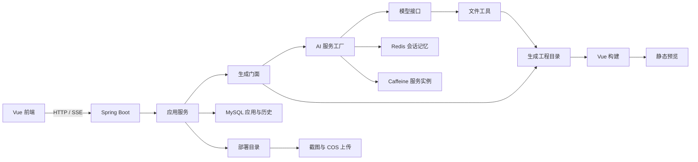

[README.md](https://github.com/user-attachments/files/33189145/README.md)
# 智构工坊｜AI 网站生成与迭代平台

通过自然语言创建网站，并在多轮对话中继续修改页面。项目支持 HTML、HTML/CSS/JavaScript 多文件页面与 Vue 工程三种生成方式，串联流式展示、文件操作、工程构建、网站预览、静态部署和源码下载。

这是一个 Java 后端与 AI 应用开发实践项目。本文依据当前仓库源码整理，主业务流程与独立工作流模块分别说明；配置、构建和运行效果以实际环境验证为准。

## 功能概览

| 功能 | 实现内容 |
| --- | --- |
| 用户与应用管理 | 注册登录、应用创建、信息修改、个人应用列表与管理页面 |
| 多模式生成 | 根据需求选择 HTML、多文件页面或 Vue 工程生成类型 |
| 流式对话 | 使用 SSE 展示模型输出与工具操作信息，提供结束和错误事件 |
| 多轮迭代 | 按应用维护会话记忆，支持读取、修改已有工程文件 |
| 历史消息 | MySQL 持久化聊天记录，按时间游标加载历史 |
| Agent 工具 | 文件读取、写入、修改、删除与目录查询 |
| 工程交付 | Vue 工程构建、静态产物预览、部署目录复制、截图上传与 ZIP 下载 |
| 可视化编辑入口 | 前端支持选取预览元素，将元素上下文与修改需求一起提交 |
| 请求治理 | 自定义限流注解、Redisson 限流、输入输出 Guardrail |
| 独立工作流 | 素材收集、提示词增强、生成路由、代码生成、质量检查和构建的图式编排 |

## 技术栈

| 层次 | 技术 |
| --- | --- |
| 后端基础 | Java 21、Spring Boot 3.5.3、Maven |
| AI 调用 | LangChain4j、OpenAI 兼容模型接口 |
| 工作流 | LangGraph4j 1.6.0-rc2 |
| 流式通信 | Reactor、Flux、SSE、浏览器 EventSource |
| 数据存储 | MySQL、MyBatis-Flex 1.11.0 |
| 缓存与会话 | Redis、Spring Session、Caffeine、Redisson 3.50.0 |
| 前端 | Vue 3、Vue Router、Pinia、Ant Design Vue、Axios、Vite 7 |
| 构建与截图 | npm、Java 21 虚拟线程、Selenium、WebDriverManager |
| 对象存储与素材 | 腾讯云 COS、Pexels、DashScope；按对应功能配置 |

LangChain4j 主组件和部分扩展组件在当前 POM 中使用不同版本。调整依赖前请先核对 `mvn dependency:tree`，并验证流式调用、工具调用和 Guardrail 的兼容性。

## 架构与核心流程



### 网站生成链路

1. 创建应用时，路由服务根据初始需求确定生成类型，并生成应用名称。
2. `/app/gene` 获取应用，保存用户消息，调用 `AICodeGeneratorFaced`。
3. HTML 和多文件模式将文本流累积为完整输出，再由解析器和保存模板生成文件。
4. Vue 模式注册文件工具，模型通过工具调用逐步生成或修改工程；TokenStream 回调转换为 Flux。
5. 流处理器记录 AI 历史，控制器将内容作为 SSE 推送给前端。
6. Vue 生成完成后触发异步构建，前端轮询静态预览，等待 `dist` 可访问。
7. 用户调用部署接口时，后端构建或检查工程、复制静态文件、更新部署信息，并异步生成封面截图。

**生成结束、构建完成、部署成功是不同阶段。** SSE 的 `done` 事件表示生成流结束，不能直接视为 Vue 工程已经构建成功。

### 会话记忆与历史

- Caffeine 缓存以 `生成类型_appId` 为 key 的 AI 服务实例，最大 1000 个，设置写入与访问过期时间。
- Redis 保存供模型使用的会话记忆，按 `appId` 隔离，消息窗口上限为 20 条。
- MySQL 保存业务聊天历史，用于页面展示和恢复；表中包含 `(appId, createTime)` 索引。
- 20 条消息不等于 20 轮对话，也不等于固定 token 预算。

这三处存储承担不同职责。当前会话记忆与文件工具不构成完整的 RAG 知识库链路。

### Agent 与工作流

Vue 生成模式通过 LangChain4j 注册文件工具，设置连续工具调用上限，并对不存在的工具名返回错误信息。

`langgraph4j` 目录另有独立工作流：

```text
素材收集 → 提示词增强 → 类型路由 → 代码生成 → 质量检查
                                           ↑          │
                                           └─未通过──┘
质量检查通过 → Vue 工程构建 / 其他类型结束
```

当前 `/app/gene` 使用生成门面，尚未接入这套工作流；工作流生成节点使用固定 `appId = 0`，由测试入口独立执行。接入真实业务前，需要传入应用与任务标识、设置重试预算并完善状态持久化。

## 目录结构

```text
ai-code-parent/
├─ src/main/java/com/szb/aicode/
│  ├─ ai/                 # 模型服务、工厂、Guardrail 与文件工具
│  ├─ controller/         # 用户、应用、聊天历史和静态资源接口
│  ├─ core/               # 生成门面、解析、保存、流处理和构建
│  ├─ langgraph4j/        # 独立工作流、节点、状态和素材工具
│  ├─ ratelimiter/        # 限流注解、切面与 Redisson 配置
│  ├─ service/            # 应用、历史、下载和截图业务
│  └─ config/             # 模型、Redis、缓存、跨域等配置
├─ src/main/resources/
│  ├─ application.yml     # 基础配置
│  ├─ prompt/             # 各生成类型与工作流提示词
│  └─ sql/create_table.sql
├─ src/test/java/         # 模型、生成门面、工作流与截图测试
├─ view/                  # Vue 前端
├─ tmp/code_output/       # 运行时生成目录
├─ tmp/code_deploy/       # 运行时部署目录
└─ pom.xml
```

`tmp` 下的目录按需创建，根路径基于 Java 进程的 `user.dir`。后端应从项目根目录启动，避免切换工作目录后找不到已有工程。

## 本地启动

### 1. 环境准备

| 环境 | 要求与用途 |
| --- | --- |
| JDK | 21；项目使用虚拟线程等 Java 21 API |
| Maven | 3.x，用于依赖解析与构建 |
| Node.js | 20.19+ 或 22.12+；依据当前 Vite 7 锁文件要求 |
| MySQL | 建议 8.x，默认数据库名 `ai_code` |
| Redis | 默认端口 6379，用于记忆、登录会话、缓存与限流 |
| 模型服务 | 提供可用的兼容接口；Vue 模式还需支持对应的工具调用能力 |
| Chrome / 驱动 | 用于部署截图，运行环境须能提供兼容的浏览器驱动 |
| COS | 截图上传使用，需配置自己的存储桶与凭据 |

### 2. 初始化数据库

使用 MySQL 客户端或数据库工具执行：

```sql
CREATE DATABASE IF NOT EXISTS ai_code
  CHARACTER SET utf8mb4 COLLATE utf8mb4_unicode_ci;
USE ai_code;
SOURCE src/main/resources/sql/create_table.sql;
```

`SOURCE` 是 MySQL 客户端命令，相对路径按客户端工作目录解析；在图形工具中可打开该 SQL 文件并在 `ai_code` 库执行。脚本中的 `app`、`chat_history` 建表语句不支持重复创建，已有数据库不要直接重复导入。

### 3. 配置本地环境

核对 `src/main/resources/application.yml`。推荐在项目根目录新建仅供本机使用的 `config/application-local.yml`，覆盖连接信息；实际值由环境变量或 IDE 运行配置提供，不提交凭据。

```yaml
spring:
  datasource:
    url: jdbc:mysql://127.0.0.1:3306/ai_code?characterEncoding=utf-8&serverTimezone=Asia/Shanghai&useSSL=false
    username: ${DB_USERNAME}
    password: ${DB_PASSWORD}
  data:
    redis:
      host: ${REDIS_HOST:127.0.0.1}
      port: ${REDIS_PORT:6379}
      password: ${REDIS_PASSWORD:}
      ttl: 3600

langchain4j:
  open-ai:
    chat-model:
      api-key: ${AI_API_KEY}
      base-url: ${AI_BASE_URL:https://api.deepseek.com}
      model-name: ${AI_CHAT_MODEL:deepseek-chat}
      log-requests: false
      log-responses: false
    streaming-chat-model:
      api-key: ${AI_API_KEY}
      base-url: ${AI_BASE_URL:https://api.deepseek.com}
      model-name: ${AI_CHAT_MODEL:deepseek-chat}
      log-requests: false
      log-responses: false
    reasoning-streaming-chat-model:
      api-key: ${AI_API_KEY}
      base-url: ${AI_BASE_URL:https://api.deepseek.com}
      model-name: ${AI_REASONING_MODEL:deepseek-reasoner}
      log-requests: false
      log-responses: false
    routing-chat-model:
      api-key: ${AI_API_KEY}
      base-url: ${AI_BASE_URL:https://api.deepseek.com}
      model-name: ${AI_CHAT_MODEL:deepseek-chat}
      log-requests: false
      log-responses: false

cos:
  client:
    secretId: ${COS_SECRET_ID}
    secretKey: ${COS_SECRET_KEY}
    region: ${COS_REGION:ap-beijing}
    bucket: ${COS_BUCKET}
    host: ${COS_HOST}

pexels:
  api-key: ${PEXELS_API_KEY:}
dashscope:
  api-key: ${DASHSCOPE_API_KEY:}
```

启动前需要设置 `DB_USERNAME`、`DB_PASSWORD`、`AI_API_KEY` 和 COS 相关变量。素材服务密钥用于独立工作流；未配置时不要执行对应素材节点。当前 COS 客户端会随应用创建，不能仅因暂时不截图就省略它的初始化配置。

如修改后端端口，需要同时调整 `view/vite.config.js` 中的代理目标。

### 4. 启动后端

在项目根目录执行：

```shell
mvn spring-boot:run "-Dspring-boot.run.profiles=local"
```

也可在 IDEA 中启动 `com.szb.aicode.AiCodeApplication`，设置 `local` profile、环境变量和项目根工作目录。

默认后端入口：[http://localhost:8300/api](http://localhost:8300/api)。接口文档入口：[http://localhost:8300/api/doc.html](http://localhost:8300/api/doc.html)。

### 5. 启动前端

在另一个终端执行：

```shell
cd view
npm ci
npm run dev
```

开发页面通常为 [http://localhost:5173](http://localhost:5173)，以终端实际地址为准。`.env.development` 中 `VITE_API_BASE_URL=/api`，Vite 将 `/api` 代理到后端 8300 端口。

生成 Vue 工程的 npm 命令由后端子进程执行，因此 Node.js/npm 也必须对启动 Java 的进程可见。Windows 上后端使用 `npm.cmd`。

### 6. 验证主要功能

1. 注册并登录，创建一个应用。
2. 提交简单页面需求，观察流式内容与历史记录。
3. 在同一应用内继续修改需求，验证已有文件变化。
4. Vue 模式等待构建完成后再预览；流结束后暂时出现 building 状态属于当前流程。
5. 下载源码并检查目录内容；部署后检查静态产物和封面上传结果。

## 静态部署

后端将文件复制到 `tmp/code_deploy/<deployKey>`，默认返回 `http://localhost/<deployKey>`。复制文件本身不会自动启动静态服务器，需要配置 Nginx 或其他静态托管服务。

Nginx 最小示例，`root` 替换为实际部署目录：

```nginx
server {
    listen 80;
    server_name localhost;
    root /absolute/path/to/ai-code-parent/tmp/code_deploy;
    index index.html;

    location / {
        try_files $uri $uri/ =404;
    }
}
```

Windows 的 Nginx 配置可使用 `D:/.../tmp/code_deploy`。该示例只提供静态文件访问；自定义 Vue history 路由还需要按应用目录设置回退规则。

更换部署域名时，同时核对 `AppConstant.CODE_DEPLOY_HOST` 与前端 `VITE_DEPLOY_DOMAIN`。生成目录的 `/api/static/...` 预览与部署域名访问是两条不同路径。

若用反向代理转发 SSE，应关闭该接口的响应缓冲并设置合适的读取超时，避免前端一直等待到生成结束才收到内容。

## 主要接口

下表包含 `/api` 上下文前缀；参数与返回结构以 Controller 和接口文档为准。

| 方法 | 路径 | 说明 |
| --- | --- | --- |
| POST | `/api/user/register` | 用户注册 |
| POST | `/api/user/login` | 用户登录 |
| POST | `/api/app/add` | 创建应用 |
| GET | `/api/app/gene?appId=...&message=...` | SSE 生成与迭代 |
| GET | `/api/chatHistory/getPage/{appId}` | 加载历史，支持 `lastTime`、`pageSize` |
| POST | `/api/app/deploy?appId=...` | 构建并部署静态产物 |
| GET | `/api/app/download/{appId}` | 下载工程 ZIP |
| GET | `/api/static/{codeGenType}_{appId}/` | 生成工程预览，Vue 使用 `dist` |

登录状态通过 Session/Cookie 保存，前端 Axios 与 EventSource 都配置了携带凭据。当前生成接口按用户限制为每 60 秒 5 次请求；这属于请求频率限制，不等于并发任务或模型 token 预算限制。

## 构建、测试与排查

```shell
# 后端打包，不执行依赖外部环境的测试
mvn -DskipTests package

# 检查依赖版本
mvn dependency:tree

# 在模型、数据库、Redis、浏览器等环境准备完成后执行测试
mvn test

# 前端生产构建，在 view 目录执行
npm run build
```

| 现象 | 优先检查 |
| --- | --- |
| 应用无法启动 | JDK 是否为 21，本地 profile、模型/COS 占位变量、MySQL 与 Redis |
| 模型返回鉴权或工具错误 | API key、base URL、模型名称与实际工具调用支持 |
| Vue 一直构建中 | 后端能否找到 npm，依赖安装日志、构建退出码、`dist` 是否生成 |
| 预览 404 | 应用类型与 ID、Java 工作目录、Vue 构建结果 |
| 部署地址打不开 | 静态服务器是否启动，部署目录映射与前后端域名是否一致 |
| 截图失败 | Chrome/驱动兼容性、页面可达性、COS 配置 |
| SSE 内容延迟出现 | 代理缓冲、连接超时、浏览器事件处理 |

## 当前开发状态

- 主生成链路、独立工作流、构建和部署已分别实现；工作流尚未集成主业务接口。
- 同一应用并发生成的串行控制、任务取消、构建状态与产物版本管理仍需完善。
- 输入输出 Guardrail 是辅助校验；应用归属校验、文件路径边界和构建执行隔离仍需补齐后再开放给不可信用户。
- 历史恢复去重、复合游标分页、ZIP 过滤与共享浏览器并发管理是后续优化方向。
- 当前测试包含外部模型和环境依赖，未提供覆盖所有异常链路的离线测试或性能基准。

